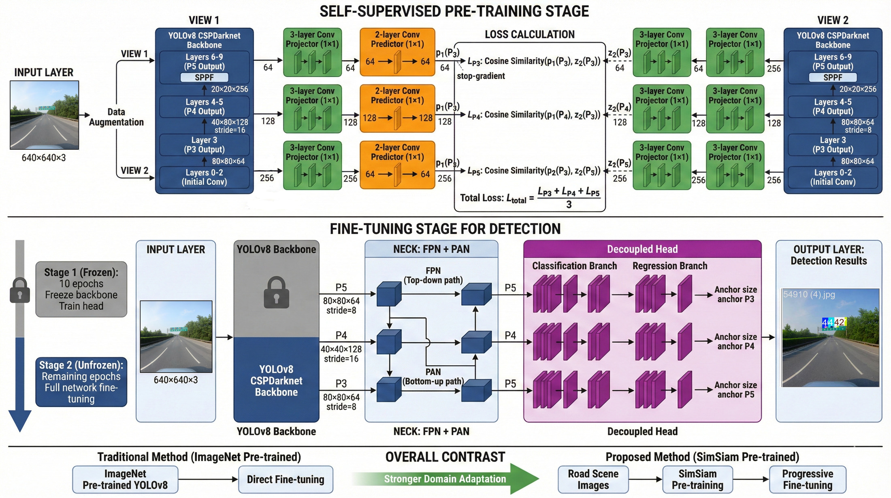
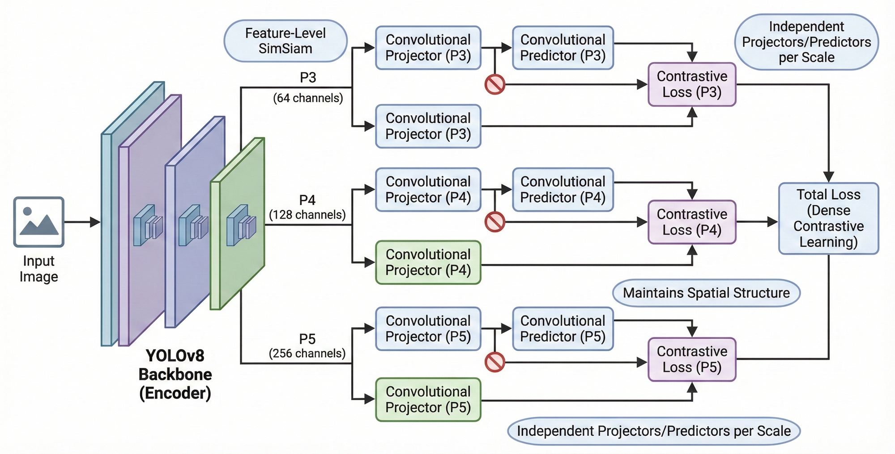
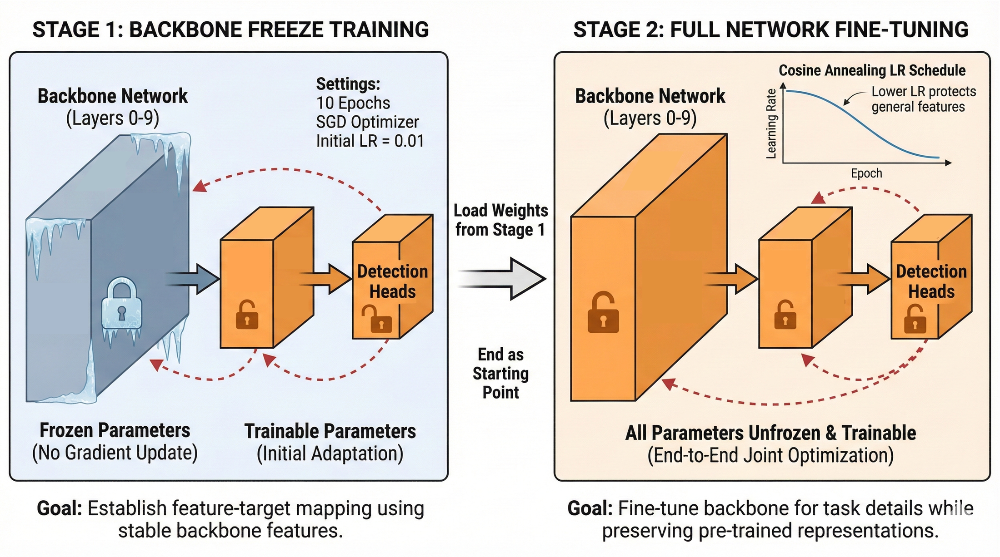
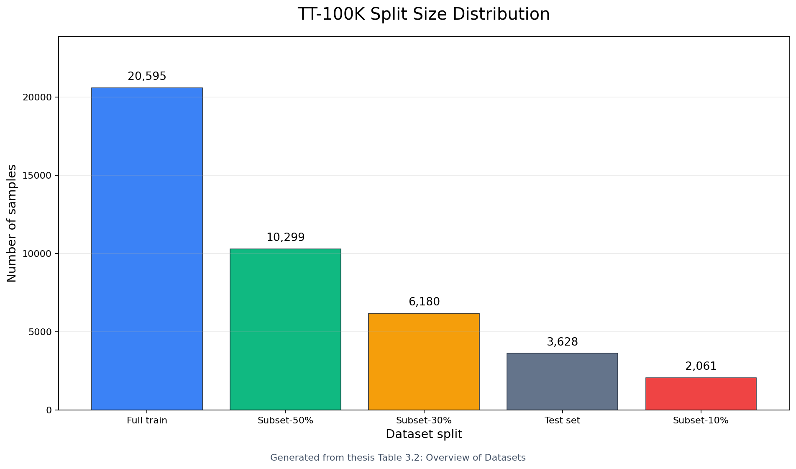
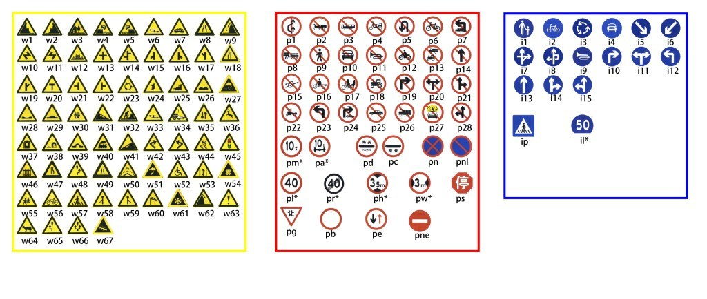
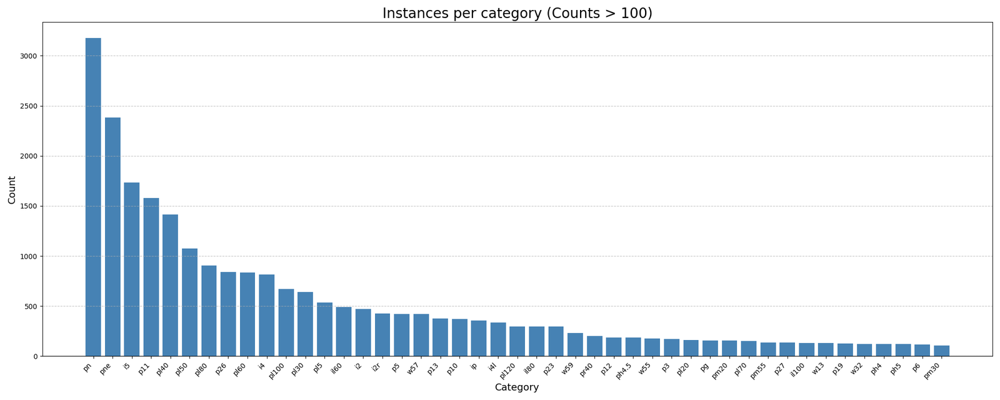
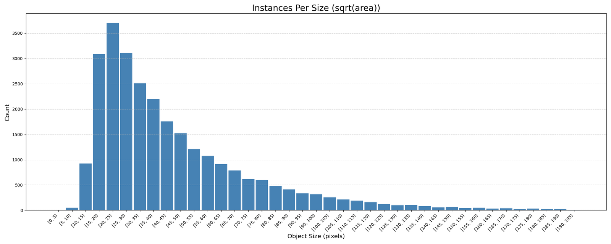
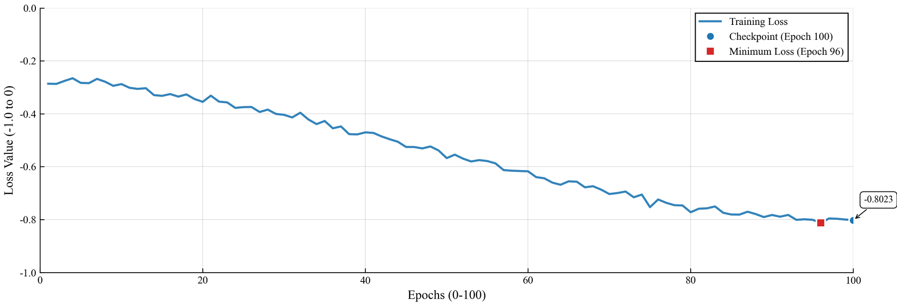
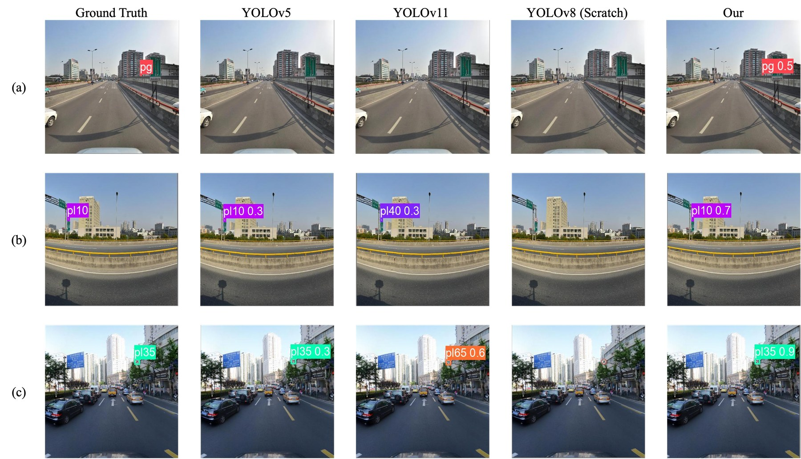

# Traffic Sign Detection Using SimSiam-Enhanced YOLOv8

[](https://www.python.org/downloads/)
[](https://pytorch.org/)
[](https://github.com/ultralytics/ultralytics)

This repository implements the thesis project **Traffic Sign Detection Using SimSiam-Enhanced YOLOv8 With Limited Labeled Data**. The core idea is to use **Feature-Level SimSiam** self-supervised pre-training on unlabeled TT-100K road-scene images, transfer the learned backbone weights into YOLOv8, and fine-tune the detector with a progressive unfreezing strategy under limited labeled data.

The thesis PDF is available at [docs/thesis/Traffic_Sign_Detection_Using_SimSiam-Enhanced_YOLOv8_With_Limited_Labeled_Data.pdf](docs/thesis/Traffic_Sign_Detection_Using_SimSiam-Enhanced_YOLOv8_With_Limited_Labeled_Data.pdf).

## Project Highlights

- Feature-level self-supervised pre-training keeps the P3/P4/P5 spatial feature maps instead of collapsing each image into a global vector.
- Dense cosine similarity loss is applied at every spatial location, helping the backbone learn small-object and localization-sensitive representations.
- Progressive unfreezing freezes YOLOv8 backbone layers first, lets the neck and detection head adapt, then unfreezes the full model for end-to-end fine-tuning.
- Experiments use nested 10%, 30%, and 50% TT-100K labeled subsets to evaluate data efficiency.
- At 30% labeled data, the proposed method reaches 0.608 mAP50, outperforming ImageNet baseline 0.595 and scratch/YOLOv5 0.555.
- At 50% labeled data, the proposed method reaches 0.661 mAP50 and 0.549 mAP50-95, outperforming the ImageNet baseline by 8.9% relative mAP50 and 9.6% relative mAP50-95.

## Overall Architecture

<p align="center">
  
</p>

The framework has two stages. In self-supervised pre-training, two augmented views of the same unlabeled road-scene image are passed through a YOLOv8-style backbone. Multi-scale feature maps P3, P4, and P5 are processed by independent projectors and predictors, and the network is optimized with dense cosine similarity. In supervised fine-tuning, the SimSiam-pretrained backbone initializes YOLOv8 and is adapted to labeled TT-100K subsets.

## Feature-Level SimSiam

<p align="center">
  
</p>

Classic SimSiam was designed for classification and uses global average pooling, which discards spatial layout. This project adapts SimSiam for object detection by preserving feature-map structure and applying projection/prediction at multiple scales.

| Feature map | Spatial resolution | Channel depth | Receptive field | Role in traffic sign detection |
| --- | ---: | ---: | --- | --- |
| P3 | 80 x 80 | 256 | Small | Fine details such as digits, arrows, and small signs |
| P4 | 40 x 40 | 512 | Medium | Overall sign geometry and surrounding edges |
| P5 | 20 x 20 | 1024 | Large | Global road-scene context |

The dense cosine similarity loss compares predictor output from one view with stop-gradient projector output from the other view at each spatial location. The three scale losses are averaged so no single feature level dominates optimization.

## Progressive Unfreezing Strategy

<p align="center">
  
</p>

Directly fine-tuning the whole detector can cause catastrophic forgetting because randomly initialized detection heads may disrupt the pretrained backbone. The thesis therefore uses a two-stage fine-tuning schedule.

| Stage | Trainable modules | Frozen modules | Epochs | Learning setup | Purpose |
| --- | --- | --- | ---: | --- | --- |
| Stage 1: frozen backbone | Neck and detection head | Backbone layers 0-9 | 10 | SGD, LR 0.01 | Let detection layers adapt to stable pretrained features |
| Stage 2: full fine-tuning | Backbone, neck, and head | None | Remaining epochs | Cosine annealing / lower LR | Adapt the full network to TT-100K detection |

## Dataset Distribution

The experiments use TT-100K, a large-scale traffic-sign dataset with long-tail class imbalance and many small objects. The project simulates limited-label settings through fixed-seed nested subsets, so 10% is contained in 30%, and 30% is contained in 50%.

<p align="center">
  
</p>

| Split | Collection ratio | Samples |
| --- | ---: | ---: |
| Subset-10% | 0.1 | 2,061 |
| Subset-30% | 0.3 | 6,180 |
| Subset-50% | 0.5 | 10,299 |
| Full training set | 1.0 | 20,595 |
| Test set | - | 3,628 |

<p align="center">
  
</p>

<p align="center">
  
</p>

<p align="center">
  
</p>

These figures explain why the method focuses on spatially dense pre-training. Many traffic signs occupy a small area in high-resolution road images, and category frequency is strongly imbalanced.

## Small-Object Augmentation

The thesis modifies SimCLR-style augmentation for traffic signs so augmented views still retain meaningful sign information.

| Parameter | Standard SimCLR setting | This project |
| --- | ---: | ---: |
| RandomResizedCrop lower scale | 0.08 | 0.20 |
| RandomResizedCrop upper scale | 1.00 | 1.00 |
| Gaussian blur sigma | [0.1, 2.0] | [0.1, 1.0] |

The higher crop lower bound reduces the chance of removing small signs entirely. The lower blur radius preserves high-frequency details such as numbers, arrows, borders, and sign symbols.

## Training Setup

| Category | Component | Configuration |
| --- | --- | --- |
| Hardware | CPU | Intel Core i9 |
| Hardware | GPU | NVIDIA RTX 3090 |
| Hardware | RAM | 24 GB |
| Software | Operating system | Linux |
| Software | Language | Python 3.8.10 in thesis experiments; Python 3.10+ in package metadata |
| Software | Framework | PyTorch 2.0+, Ultralytics |
| Software | CUDA | 11.8 |

| Stage | Image size | Epochs | Batch | Optimizer | LR | Weight decay | Remarks |
| --- | ---: | ---: | ---: | --- | ---: | ---: | --- |
| Pre-training | 640 | 100 | 32 | SGD | 0.05 | 1e-4 | Cosine annealing |
| Fine-tuning | 640 | 100 | 16 | SGD | 0.01 | 5e-4 | Warmup / early stop |

## Pre-training Result

<p align="center">
  
</p>

The dense cosine similarity loss steadily decreases over 100 epochs, showing that the encoder learns stable road-scene representations from unlabeled images before supervised fine-tuning.

## Ablation Study

The ablation experiment compares direct fine-tuning with the progressive unfreezing strategy on the 30% TT-100K subset.

| Strategy | Precision | Recall | mAP50 | mAP50-95 |
| --- | ---: | ---: | ---: | ---: |
| Direct | 0.625 | 0.537 | 0.597 | 0.492 |
| Progressive | 0.664 | 0.522 | 0.608 | 0.504 |

Progressive unfreezing improves precision, mAP50, and mAP50-95, supporting the thesis claim that staged adaptation helps protect pretrained backbone features while the detection head stabilizes.

## Comparative Experiments

| Model | 10% P | 10% R | 10% mAP50 | 10% mAP50-95 | 30% P | 30% R | 30% mAP50 | 30% mAP50-95 | 50% P | 50% R | 50% mAP50 | 50% mAP50-95 |
| --- | ---: | ---: | ---: | ---: | ---: | ---: | ---: | ---: | ---: | ---: | ---: | ---: |
| Baseline (ImageNet) | 0.444 | 0.416 | 0.391 | 0.308 | 0.672 | 0.505 | 0.595 | 0.484 | 0.668 | 0.518 | 0.607 | 0.502 |
| Scratch | - | - | - | - | 0.641 | 0.476 | 0.555 | 0.455 | - | - | - | - |
| Proposed SimSiam-YOLOv8 | 0.294 | 0.441 | 0.314 | 0.240 | 0.664 | 0.522 | 0.608 | 0.504 | 0.733 | 0.550 | 0.661 | 0.549 |
| YOLOv5 | - | - | - | - | 0.641 | 0.476 | 0.555 | 0.455 | - | - | - | - |
| YOLOv11 | - | - | - | - | 0.663 | 0.517 | 0.596 | 0.488 | - | - | - | - |

Key observations from the thesis:

- In the extreme 10% setting, ImageNet pre-training remains stronger because it benefits from 1.2M labeled natural images.
- At 30%, domain-specific SimSiam pre-training reaches the tipping point and surpasses both ImageNet baseline and scratch training.
- At 50%, the advantage expands, especially on mAP50-95, indicating better localization quality for traffic signs.
- Recall improves at 50%, which is valuable for safety-critical detection where missed signs are costly.

## Qualitative Detection Result

<p align="center">
  
</p>

The thesis qualitative comparison shows that the proposed model detects small speed-limit signs under shadowed and rotated viewing angles where weaker baselines either miss the target or give lower-confidence detections. This supports the interpretation that domain-specific self-supervised features are more robust to lighting and viewpoint changes.

## Quick Start

```bash
git clone https://github.com/XiaoSong1223/SimSiam-YOLO.git
cd SimSiam-YOLO
python -m pip install -e .
```

Prepare a limited-label TT-100K split:

```bash
python -m simsiam_yolo.data.prepare_data_split \
  --train-images data/tt100k_2021/train/images \
  --train-labels data/tt100k_2021/train/labels \
  --original-yaml data/tt100k_2021/data.yaml \
  --percentage 0.3 \
  --output-dir data/TT100K_Subsets/train_30percent \
  --seed 42 \
  --symlink
```

Note: the current split helper writes the generated YAML as `data_10pct.yaml` even when `--percentage` is set to 0.3 or 0.5. Use that generated file path, or rename it after creation.

Run Feature-Level SimSiam pre-training on unlabeled images:

```bash
python -m simsiam_yolo.training.pretrain \
  data/tt100k_2021/train/images \
  --epochs 100 \
  --batch-size 32 \
  --lr 0.05 \
  --imgsz 640 \
  --save-dir artifacts/checkpoints
```

Convert a SimSiam checkpoint to YOLOv8-compatible weights:

```bash
python -m simsiam_yolo.tools.convert_weights \
  artifacts/checkpoints/checkpoint_0099.pth.tar \
  --cfg yolov8n.yaml \
  --output artifacts/weights/yolov8_simsiam_pretrained.pt
```

Fine-tune with the proposed two-stage strategy:

```bash
python -m simsiam_yolo.training.finetune \
  --mode ours \
  --data data/TT100K_Subsets/train_30percent/data_10pct.yaml \
  --pretrained-weights artifacts/weights/yolov8_simsiam_pretrained.pt \
  --epochs 100 \
  --freeze 10 \
  --batch 16 \
  --imgsz 640 \
  --optimizer SGD \
  --lr0 0.01 \
  --save
```

Run comparison baselines:

```bash
python -m simsiam_yolo.training.finetune --mode baseline --data data/TT100K_Subsets/train_30percent/data_10pct.yaml --epochs 100
python -m simsiam_yolo.training.finetune --mode scratch --data data/TT100K_Subsets/train_30percent/data_10pct.yaml --epochs 100
```

## Repository Layout

```text
SimSiam-YOLO/
|-- src/simsiam_yolo/
|   |-- data/prepare_data_split.py
|   |-- models/simsiam_yolo.py
|   |-- models/yolo_encoder.py
|   |-- tools/convert_weights.py
|   `-- training/
|       |-- pretrain.py
|       `-- finetune.py
|-- docs/
|   |-- images/
|   `-- thesis/
|-- external/
|   |-- simsiam/
|   `-- ultralytics/
|-- pyproject.toml
`-- README.md
```

## Thesis Conclusions

The thesis concludes that Feature-Level SimSiam is most useful once labeled data is no longer extremely scarce. ImageNet pre-training is still better at 10% data, but domain-specific self-supervised pre-training surpasses it at 30% and widens the gap at 50%. The method is especially relevant for traffic-sign detection because unlabeled road-scene images are easier to collect than high-quality bounding-box annotations, and dense feature-level pre-training better preserves the spatial information required for small-object localization.

## Acknowledgements

This project builds on SimSiam and Ultralytics YOLOv8. The thesis work was completed at Xiamen University Malaysia by Song Zhifei under the supervision of Usmani Usman Ahmad.
